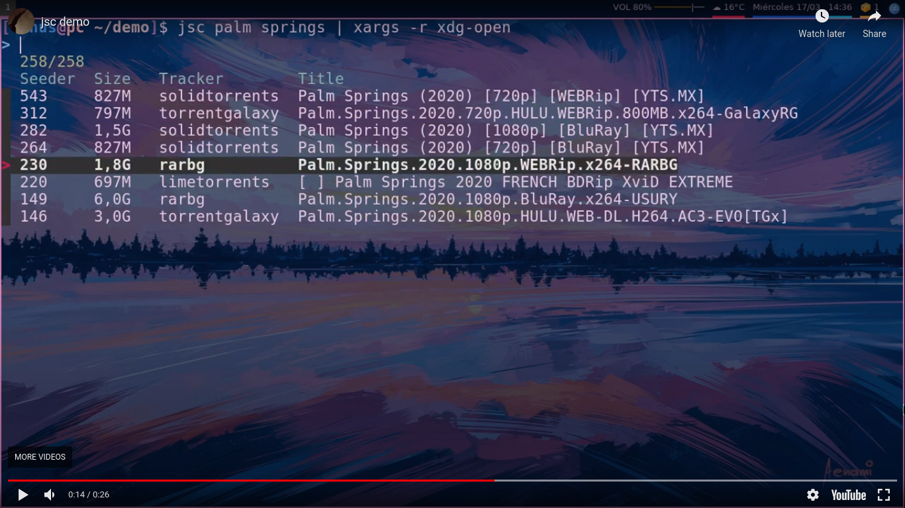

# Jackett Search Cli
A cli tool to search torrents made with the [jackett](https://github.com/Jackett/Jackett) api

# Demo

[](https://www.youtube.com/embed/vS_9F329lpQ)

# Installation

- Install the dependencies (jq, fzf, jackett)
- Add some indexers to jackett
- Copy your api key
- Download the script
 
  ```shell
  wget https://raw.githubusercontent.com/rodrigo-sys/jsc/main/jsc
  ```
- Open it
- Change 'YOUR_API_KEY_HERE' string, in the third line for you jackett api key
- Made it executable

  ```shell
  chmod +x jsc
  ```
- Put the script in somewhere in your path 
   
# Usage 
```shell
jsc <search_term>
```
if you want to filter by tracker:

```shell
jsc -t <tracker> -s <search_term>
```

# Examples

```shell
jsc -t rarbg -s 'palm springs'
```

(you need to use quotes if the search have spaces)

```shell
jsc palm springs
```

(you dont need quotes when not uses flags)

# Tips
This program just output the magnet link of the selected result.

But if you want...

- Stream 
  * With [webtorrent](https://github.com/webtorrent/webtorrent-clii)
 
  ```shell
  jsc palm springs | xargs -n 1 -r webtorrent --mpv
  ```
  
  * With [mpv-webtorrent-hook](https://github.com/mrxdst/webtorrent-mpv-hook)
  
  ```shell
    jsc queen gambit | xargs -n 1 -r mpv
  ```
 
- Download 
 
  ```shell
  jsc palm springs | xargs -n 1 -r xdg-open 
 
  ```
  
  or
 
  ```shell
  jsc palm springs | xargs -n 1 -r <torrent_client>
 
  ```
  
Make functions to make easy:
 
```shell
nfx(){ # netflix
  jsc "$@" | xargs -n 1 -r webtorrent --mpv
}
```
```shell
tpb(){ # the pirate bay
  jsc "$@" | xargs -n 1 -r xdg-open 
}
```

# Dependencies
- jq
- fzf
- jackett

# TODO
- [ ] Improve readme
- [ ] Make the demo a gif 
- [ ] Share in social media 
- [ ] Maybe add stream and open flag

# Donations
Monero address: 4AAMMG4faRAhThF2hATV3BbxauGBdoD9AKzcZwANcr2sXtCADe7jpwABkDFtrkNEodJQq4xFVhPaMAHpFUZwZ9sqCwVLM7m

